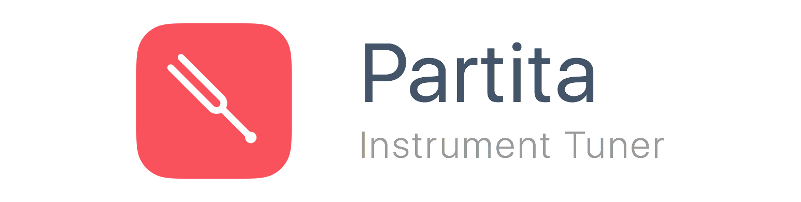
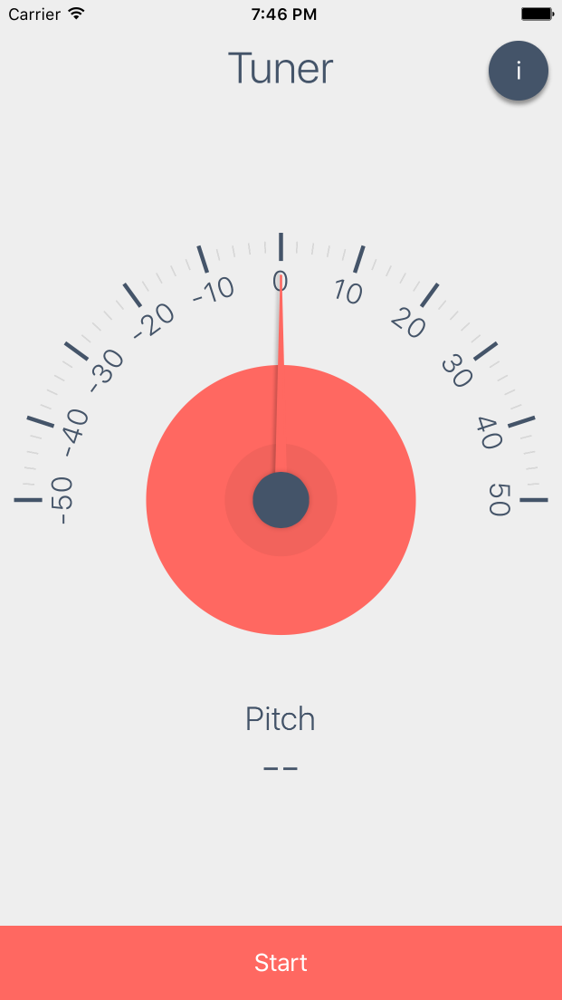
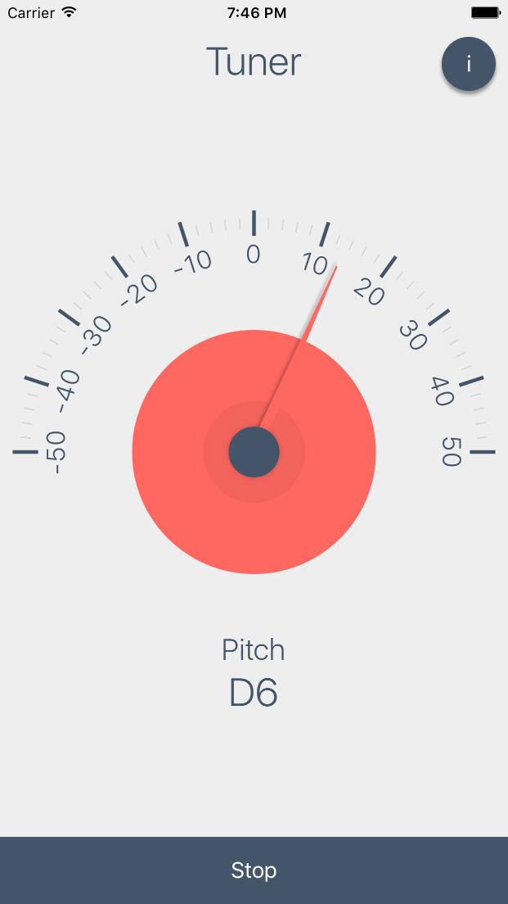

# Overview

Partita is a simple instrument tuner for iOS written in Swift, powered by [TuningFork](https://github.com/comyarzaheri/TuningFork).




# Usage 

###### Getting Started

1. Run the following commands in your terminal to download and setup the project:

	```bash
	$ git clone https://github.com/comyarzaheri/Partita.git
	$ cd Partita
	$ pod install
	$ open .
	```
2. Open `Partita.xcworkspace` in Xcode, choose your simulator, and click run.
3. Party on, Garth.

# FAQ

**"Can I fork this project, make my own changes, then release it on the App Store?"**

Yes!

**"Can I fork this project, make none of my own changes, then release it on the App Store?"**

(Less enthusiastic) Yes.

**"Can I contribute/are you taking pull requests?"**

Yes! If you contribute, then you agree that I can include any or all of your contributions in a release or update to the app in the App Store.

# License 

Partita is available under the [MIT License](LICENSE).

# Contributors

* [@comyarzaheri](https://github.com/comyarzaheri)


